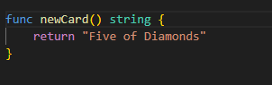

# PROJECT - Deck of cards

## Instructions:

- We will be having a deck of playing cards
- We Play around with it.
- The package that we will create will have some functions simulating messing around with the cards:
       newDeck => Create a list of playing cards
       print => Log out the contents of the deck of cards
       shuffle => Shuffle all the cars in a deck
       deal => Create a hand of cards
       saveToFile => Save a list of cards to a file on the local machine
       newDeckFromFile => Load a lost of cards from the local machine

## Steps

### Step 1:Variable declaration

### Step 2: Functions and return types

#### NOTE: The functions other than main would be either in another file and gets imported or under main()

The function should have the data type labelled.

### Step 3: Slices and For loops

### Step 4: 
