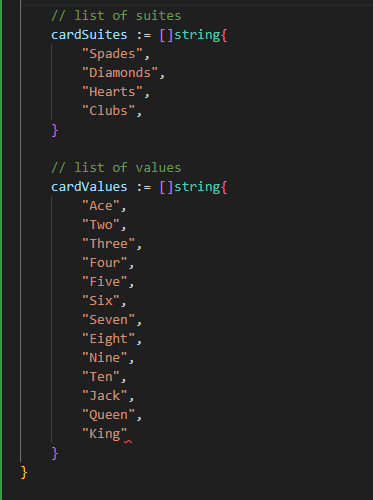
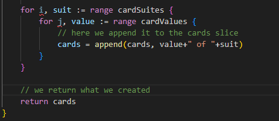

# PROJECT - Deck of cards

## Instructions:

- We will be having a deck of playing cards
- We Play around with it.
- The package that we will create will have some functions simulating messing around with the cards:
       newDeck => Create a list of playing cards
       print => Log out the contents of the deck of cards
       shuffle => Shuffle all the cars in a deck
       deal => Create a hand of cards
       saveToFile => Save a list of cards to a file on the local machine
       newDeckFromFile => Load a lost of cards from the local machine

## Steps

NOTE: We approach this project with a GO language approach which isn't using OO approach.

1. We set up a 'main.go' file in which we lay out template that includes cards slides, a newCards function and append method to test out how append works.

2. We set up 'deck.go' file and create the following:
a. a 'type' of []string called deck: 

b. function to iterate through the cards slices and use 'receivers' to set it up:
Here, the receiver argument 'd' would replace the 'Cards' slides as whenever it calls the print() method, it gets put into as an argument (d here).
Also, something to note is that the 'deck' shown here is acting like a type of []string.

In deck.go:

In main.go:

3. Now we will create the newDeck function.

To make the newDeck with all the card values, here since we are only using slices we do two slices one with suites and the other with values as:

Now we create a nested for loop to loop through it to add new card to our cards slice. and we return the cards.

4. We will now create a deal function with the 3 cards in hand and the rest on reserve.

